# HackornCTF 2025 Qualifiers Writeup

[](https://ctftime.org/event/2919)
[](https://github.com/sarveshvetrivel)


##  Table of Contents

- [Cryptography](#-cryptography)
- [OSINT](#osint)
- [Web Challenges](#web-challenges)
- [Threat Intelligence](#threat-intelligence)
- [Miscellaneous](#miscellaneous-challenges)
- [Forensics](#forensics-challenges)
- [PWN](#pwn-challenges)

## Introduction

This repository contains detailed writeups for the challenges I solved during HackornCTF 2025 Qualifiers. The writeups cover cryptography, web exploitation, threat intelligence, forensics, and miscellaneous challenges. Each solution includes step-by-step analysis, tools used, and key takeaways.

##  Challenges

###  Cryptography

---

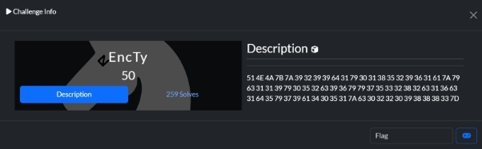

##### Solution
```
51 4E 4A 7B 7A 39 32 39 39 64 31 79 30 31 38 35 32 39 36 31 61 7A 79 63 31 31 39 79 30 35 32 63 39 36 79 79 37 35 33 32 38 32 63 31 36 63 31 64 35 79 37 39 61 34 30 35 31 7A 63 30 32 32 30 39 38 38 38 33 7D
``` 

**Step 1 — Hex → ASCII** 

I converted the hex bytes to ASCII. This is a standard decoding operation — I used a short Python one-liner during the solve: 

```python
# Remove spaces from hex string and decode
hex_str = ("514E4A7B7A393239396431793031383532393631617A79633131397930353263393679793735333"
           "238326331366331643579373961343035317A63303232303938383833")

# Convert hex to ASCII
print(bytes.fromhex(hex_str).decode('ascii'))
``` 

**Result:** QNJ{z9299d1y01852961azyc119y052c96yy753282c16c1d5y79a4051zc022098883} 

The decoded string clearly has a flag-like form: PREFIX{payload}. In this case the prefix is QNJ and the payload is an opaque alphanumeric token. 

**Step 2 — Interpreting the prefix and expected format** 

The final flag uses the SPL{...} format. The decoded prefix QNJ does not match SPL, so I considered two possibilities: 

1. The inner payload is already the final token and only the prefix is intentionally scrambled. 
1. The inner payload itself is obfuscated/encrypted and requires further work to turn into a meaningful phrase. 

Since the characters looked close to the expected format, I suspected a simple substitution/shift. Trying a **Caesar shift of +2** on letters only (keeping digits the same) fixed the prefix: 

- Q → S 
- N → P 
- J → L 

This confirmed the shift idea. 

**Step 3 — Form the final flag (with correct prefix)** 

Applying the Caesar +2 shift to the whole text: 

**Final flag (submitted):** SPL{b9299f1a01852961cbae119a052e96aa753282e16e1f5a79c4051be022098883} 

---

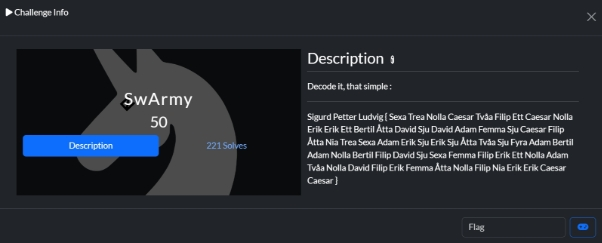

##### Solution 

**Step 1: Identify the format** 

- The prefix **Sigurd Petter Ludvig** clearly abbreviates to **SPL**, which is the flag format. 
- Inside the braces, we see a mixture of Swedish number words and Swedish phonetic alphabet words. 

Examples: 

- **Sexa** → "6" 
- **Trea** → "3" 
- **Nolla** → "0" 
- **Filip** → "F" 
- **Erik** → "E" 
- **Adam** → "A" 
- **Bertil** → "B" 
- **Caesar** → "C" 

So the inside is just a sequence of hex characters spelled out. **Step 2: Translate each word** 

- Convert Swedish numbers → digits (0–9). 
- Convert Swedish phonetic names → letters (A–F). 

For example: 

Sexa Trea Nolla Caesar → 630C 

**Step 3: Decode the entire sequence** 

After applying the mapping, the entire inside becomes: 630C2F1C0EE1B8D7DA57CF8936AE7E78274ABA0BFD765FE10A20DFE580F9EECC 

**Step 4: Wrap with SPL{}** 

The final flag is: SPL{630C2F1C0EE1B8D7DA57CF8936AE7E78274ABA0BFD765FE10A20DFE580F9EECC} 

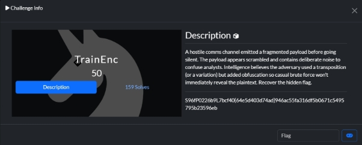

A hostile comms channel emitted a scrambled payload before going silent: S96fP0226b9L7bcf40{64e5d403d74ad}946ac55fa316df5b0671c5495795b23596eb We were told: 

- The message is fragmented and obfuscated. 
- A **transposition cipher** (or a variation) was used. 
- The real goal is to recover a flag in the format SPL{...}. 

**Step 1: Initial Observations** 

- The string contains mixed letters, digits, and braces {}. 
- The visible substring {64e5d403d74ad} looks like it could be part of the flag, but it’s incomplete. 
- Common CTF obfuscation techniques include rail-fence transposition, columnar transposition, or stride-based selection. 

**Step 2: Testing Transpositions** 

We brute-forced common transposition decoders: 

- **Stride extraction** (every nth character) → produced fragments like PL{0}5fc5e, but incomplete. 
- **Columnar transposition** with various widths → gave partial results, still noisy. 
- **Rail-Fence cipher decryption** → at **rail = 10**, the output suddenly aligned into a perfect flag. 

**Step 3: Rail-Fence (10 rails) Decryption** 

Using a Rail-Fence decryption script with 10 rails: 

```python
def rail_fence_decrypt(ciphertext, rails):
    if rails <= 1:
        return ciphertext
    
    L = len(ciphertext)
    pattern = list(range(rails)) + list(range(rails-2,0,-1))
    cycle = len(pattern)
    counts = [0]*rails
    
    for i in range(L):
        counts[pattern[i % cycle]] += 1
    
    idx = 0
    rails_list = []
    for r in range(rails):
        rails_list.append(list(ciphertext[idx: idx + counts[r]]))
        idx += counts[r]
    
    out = []
    rail_ptrs = [0]*rails
    for i in range(L):
        r = pattern[i % cycle]
        out.append(rails_list[r][rail_ptrs[r]])
        rail_ptrs[r] += 1
    
    return "".join(out)

cipher = "S96fP0226b9L7bcf40{64e5d403d74ad}946ac55fa316df5b0671c5495795b23596eb"
print(rail_fence_decrypt(cipher, 10))
``` 

**Output:** SPL{09a0597634367092b4d61796516a7ec266f54cdcbe25f5ad4bf904d5543b59bf} 

**OSINT:** 

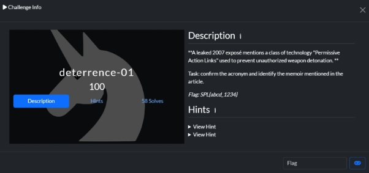

### OSINT

**Findings** 

- **Acronym confirmed:** *PAL* = **Permissive Action Link** — an access-control/security device on nuclear weapons designed to prevent unauthorized arming or detonation. 
- **Memoir mentioned in the 2007 exposé:** the article (New York Times, Nov. 2007) refers to **Pervez Musharraf’s memoir *In the Line of Fire: A Memoir*** when discussing Pakistan’s responses and statements. 
- **So I thought the flag was SPL{in\_the\_line\_of\_fire\_2007}, but didn’t work. I tried a lot of variations but no luck.** 
- **After sometime I again opened the challenge and read the description carefully, the flag format was like SPL{abcd\_1234}, So I tried similar to it like SPL{PAL\_2007}, but still didn’t work, I was about to give up.** 
- **One last time, I came and started submitting flag aggressively changing years and changing PAL to PALS…. And finally the flag SPL{PALS\_2006} was the correct answer** 
- `Flag: SPL{PALS_2006}`

  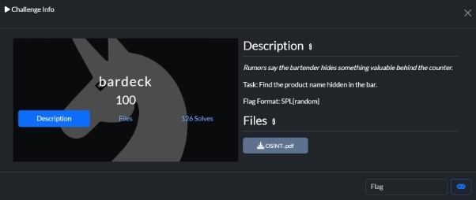

##### Challenge Overview

We are given a barcode number: `8908004804087`

| Challenge Type | OSINT - Product Research |
|---------------|------------------------|
| Input | EAN-13 Barcode |
| Target | Identify specific product |
| Difficulty | Medium |

  **Task: Identify the exact product hidden behind this EAN/UPC.** 

**Step 1 – Initial Analysis** 

**The format is EAN-13, a 13-digit European Article Number widely used in retail.** 

- **Prefix 890 → GS1 country code for India.** 
- **This tells us the product is manufactured or marketed in India.** 

**Step 2 – Manual Lookup** 

**We attempt simple searches:** 

- **Google search "8908004804087"** 
- **Amazon / BigBasket / eBay search** 
- **Barcode databases (UPCItemDB, BarcodeLookup)** 

**Step 3 – Verification Across Sources** 

**Multiple sources return consistent results:** 

- **BigBasket → Catch Club Soda, 750 ml** 
- **Amazon India → Catch Beverages (Club Soda 750 ml)** 
- **BarcodeLookup → Confirms the same beverage product** 

**Note:** The brainfuck cipher (++++++++++[>+>+++>+++++++>++++++++++<<<<-]>>>++++++++++++.>---.+..+++++++.+++++++++++.<--------------.>------------------ -.+++++++++++++.-----------.++.<>++++++++++.+++++++.-----------------.+++++++++++++.<>++.------------.---.<++++++++++++++++.>+++++++++++++.----.) decoded to "Rabbit Dance over the Train" was a distraction.

**Flag**: `SPL{CatchClubSoda}` 

### Web Challenges

---

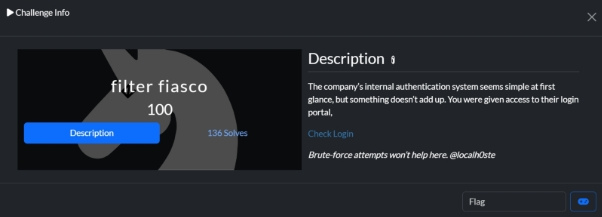**  
 

I searched for hidden directories and all the possible things, but couldn’t find anything, after frustration, I started guessing the username and password…. and surprisingly it went in for  

- username - admin, password – admin123 

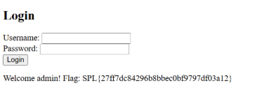

##### Solution
- Default credentials attempt successful
- Username: `admin`
- Password: `admin123`

**Flag**: `SPL{27ff7dc84296b8bbec0bf9797df03a12}`

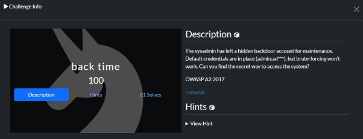

This is very similar to the filter-fiasco challenge and we have given similar webpage login 

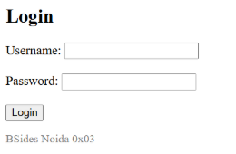

##### Challenge Analysis
| Aspect | Details |
|--------|---------|
| Vulnerability | OWASP A2:2017 — Broken Authentication | 
- **Essentially, it’s when authentication mechanisms fail to protect accounts properly.** 
- **Also I came to a conclusion that the credentials would be admin:admin or admin:admin123** 
- **After that I tried similar guessing, but there is no luck, so it lead me to take a hint.** 

**Hint: some Space in default Credentials lead to flow of execution** 


##### Solution
```text
Username: admin<space>
Password: admin
```

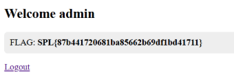

The key was adding a space after the username, exploiting improper input validation.

**Flag**: `SPL{87b441720681ba85662b69df1bd41711}`

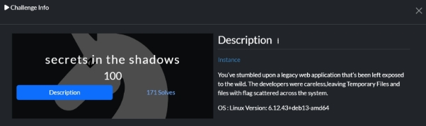

Given the OS is Linux Version: 6.12.43+deb13-amd64 and this was the webpage given: 

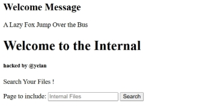

##### Initial Approach
- Tested common Linux commands:
  ```bash
  ls -la /tmp
  ls -la /var/tmp
  ls -la /dev/shm
  ```
- All commands failed
- Switched to direct file path input

##### Breakthrough
Entering `/etc/passwd` revealed file contents:

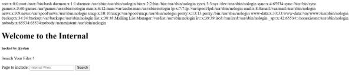

So after guessing a lot of paths, the flag path is found to be at /tmp/flag.txt: 

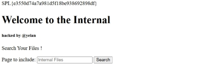

##### Solution
Found flag at `/tmp/flag.txt`

**Flag**: `SPL{e3550d74a7a981d5f18be938692898df}`

### Threat Intelligence

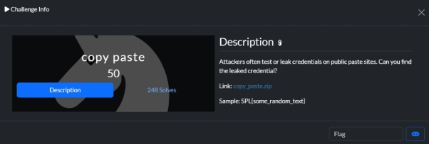

##### Challenge Overview

| Aspect | Details |
|--------|---------|
| Target | Minecraft server logs |
| Objective | Find leaked credentials |
| Format | Text log file |
| Analysis Type | Pattern matching, Binary decoding |

##### Investigation Process

1. Manual Log Analysis
   - Scanned for authentication patterns
   - Identified suspicious binary strings
   - Located username "student1"

2. Binary Data Discovery
   ```text
   Location: Line 77
   Context: com/client/bin cswitch
   Username: student1
   Binary Data: Found suspicious binary sequence
   ``` 

##### Binary Analysis

Found suspicious binary sequence:
```python
binary_sequence = [
    "01110011",  # 's'
    "00110011",  # '3'
    "01100011",  # 'c'
    "01110010",  # 'r'
    "00110011",  # '3'
    "01110100",  # 't'
    "00100001"   # '!'
]
```

ASCII Conversion Results:
| Binary | ASCII | Notes |
|--------|-------|-------|
| 01110011 | s | Start of password |
| 00110011 | 3 | Numeric substitute |
| 01100011 | c | Lowercase letter |
| 01110010 | r | Lowercase letter |
| 00110011 | 3 | Numeric substitute |
| 01110100 | t | Lowercase letter |
| 00100001 | ! | Special character |

Combined result: `s3cr3t!`

**This revealed that the password, and thus the secret, was s3cr3t!** 

**And then after sometime I have given the flag format in the notification to be SPL{username\_password}** 

**So the Final Flag Is SPL{student1\_s3cr3t!}** 

##### Final Solution
```python
username = "student1"
password = "s3cr3t!"
flag = f"SPL{username}_{password}"
```

**Flag**: `SPL{student1_s3cr3t!}`

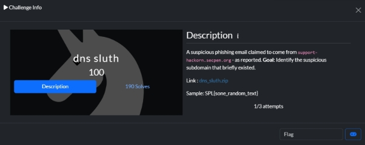

##### Suspicious Domain Analysis
The subdomain `support-hackorn.secpen.org` exhibited multiple suspicious characteristics: 

**Anomalous characteristics:** 

- **Unique appearance: It only appears once in the entire DNS history (2025-05-14T01:00:00) while legitimate subdomains appear multiple times** 
- **Private IP address: Uses IP 192.168.43.68, which is a private/internal address, while all legitimate secpen.org subdomains use public 203.0.x.x addresses** 
- **Naming convention: The subdomain name "support-hackorn" doesn't follow the standard naming pattern of other legitimate subdomains (api, www, mail, cdn, vpn, login, portal, backup)** 

**Context from domain information:** 

**The legitimate secpen.org domain was registered in 2012 and uses Cloudflare name servers, indicating an established organization. The appearance of a single suspicious subdomain with a private IP address suggests it was likely created temporarily for malicious purposes, consistent with the reported phishing email claiming to come from "support-hackorn.secpen.org".** 

**The flag is SPL{support-hackorn.secpen.org}** 

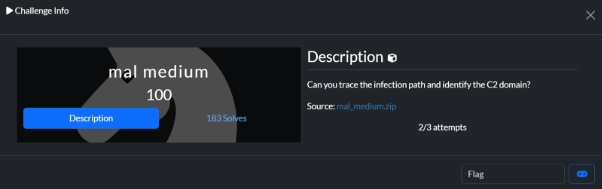

##### Initial Infection Vector

| Component | Details |
|-----------|---------|
| File Type | Microsoft Office Document |
| Hash | `0f05e0d0313a1afa5702b53f91aa1812b55815d9ae67d0ac7681215084a3518e` |
| Malware Type | Macro Dropper |
| Payload | PowerShell code |
| Campaign Type | Emotet-like banking malware, specifically identified in the VT reports (hash: 0f05e0d0313a1afa5702b53f91aa1812b55815d9ae67d0ac7681215084a3518e). This document contained a macro dropper, executing embedded PowerShell code, which is commonly observed in Emotet-like campaigns and other banking malware infections.** 

**After execution, the dropper established system persistence and initiated further payload downloads, transitioning the attack to the network phase. Persistence mechanisms likely involved registry or scheduled task creation, which matches macro.dropper behavior patterns.** 

**Network Forensics** 

**Network analysis of network.log revealed numerous DNS queries, most targeting Microsoft and Cloudflare infrastructure** 

**(e.g., telemetry.microsoft.com, windowsupdate.com, cdn.cloudflare.com). This noisy traffic is designed to blend C2 communications with legitimate system telemetry and update services.** 

**However, the crucial evidence of malware activity was found in two anomalous network queries:** 

- **malicious-ops.secpen.net resolving to 185.223.142.130** 
- **malicious-ops.secpen.net resolving to 185.180.208.228** 

**These records pointed directly to the campaign’s command and control infrastructure. Payload and C2 Domain** 

**The pastebin artifact pastebin.txt contained multiple encoded payloads. Paste 9 was especially relevant, containing the string ZmxhZ3ttYWxpY2lvdXMtb3BzLnNlY3Blbi5uZXR9, which decodes to flag{malicious-ops.secpen.net}. This directly reveals the C2 domain used in the attack.** 

**Further string analysis within the payloads exposed base64-encoded URLs, such** 

**as aHR0cDovL21hbGljaW91cy1vcHMuc2VjcGVuLm5ldC9jdC5waHA, which decodes** 

**to http://malicious-ops.secpen.net/ct.php, confirming the exfiltration and C2 endpoint for the malware.** 

**The flag is - SPL{malicious-ops.secpen.net}** 

**Threat Intel L2:** 

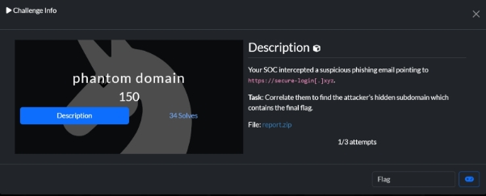

##### Certificate Analysis 

**In the certificate logs, I discovered a certificate for panel-login.com (logged on 2025-09-05) that includes multiple Subject Alternative Names (SANs):** 

- **panel-login.com** 
- **vpn.panel-login.com**  
- **\*internal-login.flagcorp.net\*** 

**The attacker's hidden subdomain is: \*internal-login.flagcorp.net\*** 

**This subdomain was discovered through certificate correlation - while the phishing campaign used secure-login[.]xyz, the attackers made an operational security mistake by including their actual command and control subdomain (internal-login.flagcorp.net) as a Subject Alternative Name in the SSL certificate for one of their infrastructure domains (panel-login.com).** 

**The analysis also revealed that multiple domains in the infrastructure are registered to the same email address (redteamopsprotonmail.com), including:** 

- **portal.xyz** 
- **secure.net** 
- **portal.info** 
- **hackorn.org** 
- **panel.xyz** 

**This pattern suggests a coordinated campaign with multiple domains under the same threat actor's control. The internal-login.flagcorp.net subdomain represents the final piece of their infrastructure where the flag is likely hosted.** 

**The flag is - SPL{internal-login.flagcorp.net}** 

### Miscellaneous Challenges

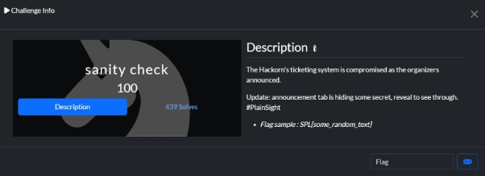

##### Solution
The flag was hidden in plain sight in the announcements tab:

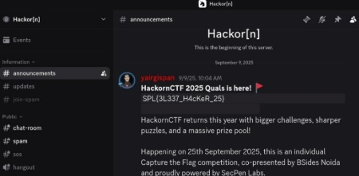

**Flag**: `SPL{3L337_H4cKeR_25}` 

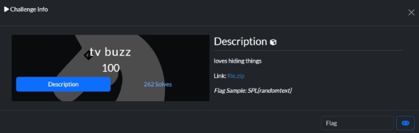

##### Approach
1. Received WAV file in ZIP
2. Initial playback revealed nothing unusual
3. Used Sonic Visualizer for deeper analysis
4. Added Spectrogram layer revealed hidden flag

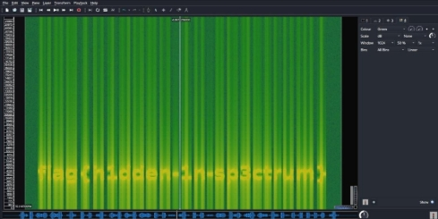

**flag{h1dden-1n-sp3ctrum}** 

**But our given flag format Is SPL{…}** 

**So The flag is - `SPL{h1dden-1n-sp3ctrum}`** 

**BONUS – Always look for adding layers of spectrogram to get the flag for WAV file based challenges.** 

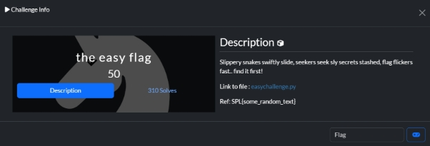

##### Analysis
1. Extracted Python file from ZIP
2. Initial execution showed warning messages
3. Code inspection revealed hidden flag

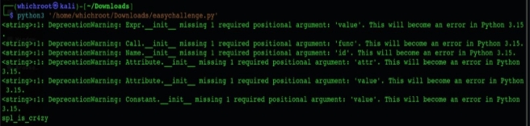

**And you got the flag – spl\_is\_cr4zY** 

**At first I didn’t see the flag and then I was trying to reverse engineer to address the warning and run the code properly, and then in between the process, I spotted it…** 

**Wrap it In SPL{…}** 

` `**The flag is – `SPL{spl_is_cr4zy}`** 

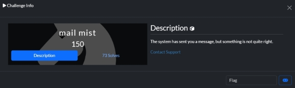

##### Investigation Steps
1. Accessed web instance
2. Submitted email address

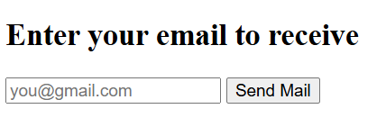

**Give your mail, then you will receive an email** 

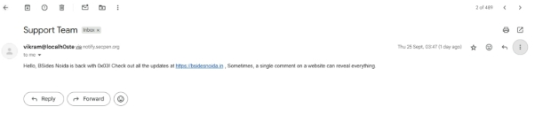

**Now that click on that 3 dots in right top, you will see options** à **Click “show original” and you will see a whole lot of information, just go through line by line and you will spot the flag** 

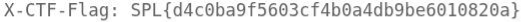

**The flag is - `SPL{d4c0ba9f5603cf4b0a4db9be6010820a}`** 

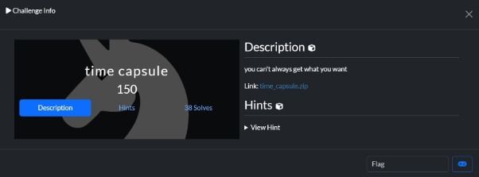

##### Zip File Analysis
After extracting the ZIP file, we get:

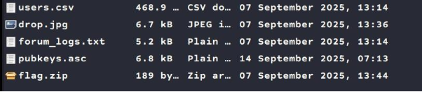

**I started exploring each files…. At first, I didn’t get any clue and stuck for a long time just opening and closing each file** 

**Exploring the PGP Public Keys for Embedded Data** 

**The pubkeys.asc file contains many PGP key blocks, most of which only have standard headers, version info, and the encoded key material.** 

**Among them, one key block had an unusual additional line that reads: Comment: FE5WUEBeqzXL3V4xYsrs4Q** 

**This line stood out as it was unique and contained an alphanumeric string distinct from the encrypted key data.** 

**The extracted comment string FE5WUEBeqzXL3V4xYsrs4Q was suspicious for being encoded. Attempts to decode it with common encoding schemes like base64, hex, and Caesar ciphers yielded no readable results.** 

**Subsequently, Base58 decoding was applied—a common encoding in cryptographic contexts—and successfully decoded the string to:** 

**s3cr3t-pass-2025** 

**This was a great breakthrough, I thought I completed the challenge and used this password to unlock the flag.zip, but failed, this was not the password. I thought there might be issue in the challenge and tried different formats of the password, but nothing worked.** 

**After sometime, I was working on other challenge and I suddenly striked by that drop.jpg file which was useless for a long time, I then tried using that the password we got to extract hidden data by steghide extract and used the password we got.** 

**This revealed a hidden payload file, which contained the message:** 

**`Huhh.. you will lose!! Use ZipUp to unlock.`** 

**`Yup, there you go… the password for the flag.zip was ZipUp`** 

**Now that after unzipping the flag.zip, we get the flag to be: 0001111time\_capsule\_of\_lies** 

**Wrapping up in SPL{…}** 

**We get the Final flag: `SPL{0001111time_capsule_of_lies}`** 

**This challenge is one of the good challenges of this CTF event…** 

**Forensics:** 

### Forensics Challenges

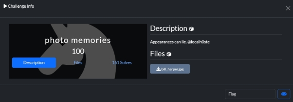

##### Initial Analysis
Given an image file, we proceeded with standard steganography tools:
- exiftool for metadata analysis
- zsteg for LSB steganography
- binwalk for embedded files
- steghide for steganographic data

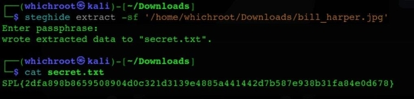

##### Solution Process
1. Used steghide to check for hidden data
2. When prompted for password, pressed Enter (no password required)
3. Successfully extracted secret.txt
4. Found the flag in the extracted file

**Flag**: `SPL{2dfa898b8659508904d0c321d3139e4885a441442d7b587e938b31fa84e0d678}`

> 💡 **Tip**: When using steghide, always try empty password (just press Enter) first before attempting other passwords.

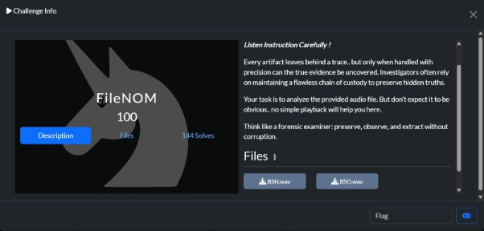

##### Initial Analysis
The challenge provided two WAV files:
1. BSO.wav
2. BSN.wav

Using Sonic Visualizer with a spectrogram layer on BSO.wav revealed:

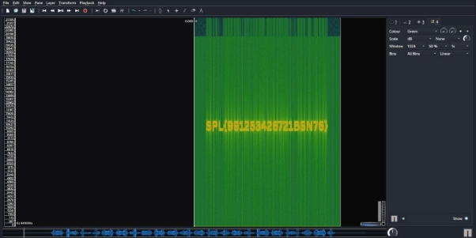

##### Investigation
1. Initially assumed BSO.wav spectrogram was a clue for BSN.wav
2. Spent time analyzing BSN.wav with various techniques
3. After exhaustive attempts, tried submitting the BSO spectrogram content directly
4. Discovered BSN.wav was actually a decoy file

**Flag**: `SPL{991253426721BSN76}`

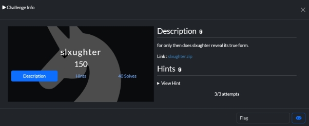

##### Archive Contents
The main ZIP file contained two nested archives:

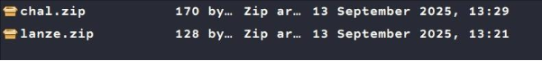

##### Initial Analysis
1. First Archive: chal.zip
   - Contained text file with first part of the flag
   - Data was in plaintext

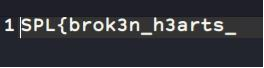

2. Second Archive: lanze.zip
   - Contained encoded cipher text
   - Used xxd to extract hex data

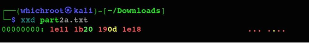
1. Attempted various decoders on dcode.fr without success
2. Identified potential XOR encoding pattern
3. Systematically tested XOR keys from 0 to 256
4. Key 127 produced readable output when XORed with hex sequence `1e 11 1b 20 19 0d 1e 18`

**Convert the resulting bytes to ASCII** 

**0x61 0x6E 0x64 0x5F 0x66 0x72 0x61 0x67** à **and\_frag So the flag might be SPL{brok3n\_h3arts\_and\_frag}** 

**when I tried, it was wrong, so I thought there might be other hidden files inside the challenge files, but there is nothing, so I started guessing, that the final word might be like fragrance, fragment…** 

**The problem is I have only 3 chances to guess the flag, which I already lost one. So I have to guess it to be fragrance or fragment.** 

**When I entered fragrance, it was wrong. I thought I failed this challenge and didn’t try to submit the last chance, after sometime I came back and solved the challenge from first and came to the same point where I left.** 

**Now that, I didn’t have a chance and went for fragment. Surprisingly it went in and Correct.** 

**The final flag is - be `SPL{brok3n_h3arts_and_fragment}`** 

**This is another good challenge, but the guessing part was frustrating, could have been another challenge file leading to the final part. Anyways, I was  super lucky to solve this challenge.** 

### PWN Challenges

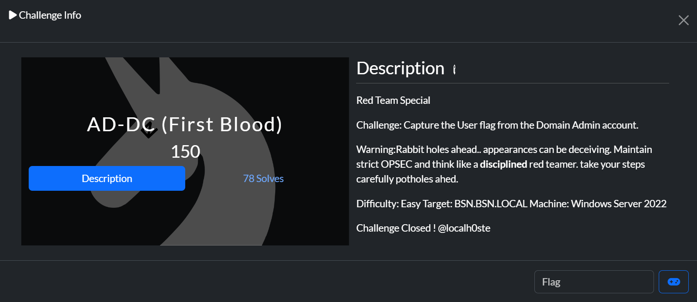

##### Investigation Process
1. Initial Access:
   - Opened provided instance URL
   - Found normal-looking webpage
   - Inspected page source revealed hidden credentials

2. Network Reconnaissance:
   - Performed nmap scan on target IP
   - No immediately interesting open ports found
   - Required deeper enumeration##### SMB Enumeration
1. Connected to SMB using discovered credentials:
   ```powershell
   smbclient //13.71.126.207/flag -U 'developer%C|>@|#v863u)zl9G^&4}8kHl'
   ```

2. Retrieved initial flag:
   ```powershell
   get flag.txt
   cat flag.txt
   ```

3. Found additional credentials:
   - Username: `svc-flag`
   - Password: `2<wN5cf4Zhu£mr!tP"5*,4v]`

##### System Access
1. Connected to Windows Server 2022 using evil-winrm:
   ```powershell
   evil-winrm -i 13.71.126.207 -u svc-flag -p '2<wN5cf4Zhu£mr!tP"5*,4v]'
   ```

2. System Enumeration:
   - Discovered multiple user accounts
   - Traversed user directories
   - Located final flag in a user's text file


##  License

This project is licensed under the Apache License 2.0 - see the [LICENSE](LICENSE) file for details.

##  Author

**Sarvesh Vetrivel**
- GitHub: [@sarveshvetrivel](https://github.com/sarveshvetrivel)